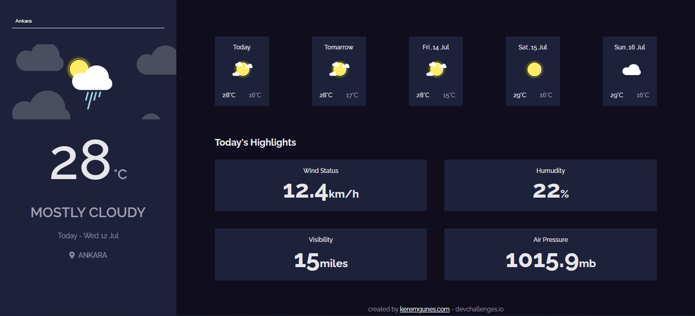

<h1 align="center">Javascript Weather App</h1>

<div align="center">
   Solution for a challenge from  <a href="http://devchallenges.io" target="_blank">Devchallenges.io</a>.
</div>

<div align="center">
  <h3>
    <a target="_blank"  href="https://js-weather-app-seven.vercel.app/">
      Demo
    </a>
    <span> | </span>
    <a target="_blank"  href="https://devchallenges.io/solutions/V3vzAgY1M2Fbi8tvHZvQ">
      Solution
    </a>
    <span> | </span>
    <a target="_blank"  href="https://devchallenges.io/challenges/mM1UIenRhK808W8qmLWv">
      Challenge
    </a>
    <span> | </span>
    <a target="_blank" href="https://www.patreon.com/keremgunes">
      Patreon
    </a>
  </h3>
</div>

<br>

## Table of Contents

- [Overview](#overview)
  - [Built With](#built-with)
- [How to use](#how-to-use)
- [Contact](#contact)
- [Will you buy me a coffee?](#will-you-buy-me-a-coffee)

## Overview



I had a lot of fun preparing this project, and then I will renew the project by adding something from myself. I hope you like it and use it :))
Api key gives 50 queries per day, if the application does not work, try again the next day. :D

### Built With

- Semantic HTML5 markup
- CSS custom properties
- Flexbox
- Scss
- Javascript
- [Accuweather API](https://developer.accuweather.com/)

## How To Use

To clone and run this application, you'll need [Git](https://git-scm.com) and [Node.js](https://nodejs.org/en/download/) (which comes with [npm](http://npmjs.com)) installed on your computer. From your command line:

```bash
# Clone this repository
$ git clone https://github.com/keremgunes27/js-weather-app

# Add your own accuwather api key (app.js)
const key = "XXXXXXXXXXXXX";
```

## Contact

- Website [keremgns.com](https://keremgns.com/)
- GitHub [@keremgunes27](https://github.com/keremgunes27)
- Twitter [@keremmgns](https://twitter.com/keremmgns)

<br>

# Will you buy me a coffee?

[Patreon](https://www.patreon.com/keremgunes)
